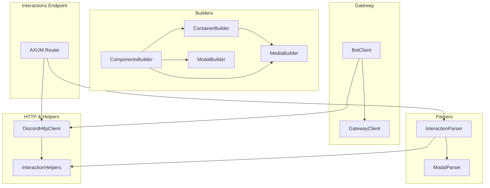

# discordrs Library Documentation

## Overview

discordrs is a standalone Rust framework for building Discord bots. It provides:

- **Gateway WebSocket runtime** for connecting, heartbeating, identifying, resuming, and dispatching events.
- **HTTP REST client** with automatic rate-limit retry for sending messages, managing commands, and responding to interactions.
- **Builders** for Components V2 payloads (buttons, selects, media galleries, modals), enabling fluent construction of rich messages.
- **Parsers** for routing and extracting data from raw interaction payloads and V2 modal submissions.
- **Helpers** and **Interaction Endpoint** support for easily replying to slash commands, component interactions, and modal submissions.

This modular design separates concerns into `builders/`, `gateway/`, `parsers/`, and `http/` directories, with core types and utilities at the root.

## Architecture Overview



## 1. Builders Module

The **builders** crate offers a fluent, type-safe API for constructing Discord Components V2 messages and modals.

### 1.1 Components (`src/builders/components.rs`)

- **Purpose:** Build individual interactive components and assemble component messages.
- **Key Types:**
  - `ButtonBuilder`: configure style, label, emoji, custom ID or URL, disabled state.
  - `SelectMenuBuilder`: create dropdown menus with options, placeholder, limits.
  - `ActionRowBuilder`: group up to five components in a row.
  - `ComponentsV2Message`: top-level container of built components.
- **Usage Example:**
  ```rust
  let button = ButtonBuilder::new()
      .label("Click me")
      .style(button_style::PRIMARY)
      .custom_id("btn_1");
  let row = ActionRowBuilder::new().add_button(button);
  let message = ComponentsV2Message::new().add_action_row(row);
  ```

### 1.2 Container (`src/builders/container.rs`)

- **Purpose:** Compose a reusable container message with text, separators, buttons, sections, media.
- **Key Types:**
  - `ContainerBuilder`: holds a sequence of components, accent color, optional spoiler.
  - `TextDisplayBuilder`: render markdown or plain text blocks.
  - `SeparatorBuilder`: insert spacing or divider between components.
- **Helpers:**
  - `create_container(title, description, buttons, image_url)`: quick factory for common layouts.
  - `create_default_buttons("general" | "status")`: returns predefined button sets.

### 1.3 Media (`src/builders/media.rs`)

- **Purpose:** Build media-rich sections and galleries.
- **Key Types:**
  - `MediaGalleryBuilder`: assemble multiple images into a scrollable gallery.
  - `SectionBuilder`: combine text, thumbnails, and accessory components into a section.
  - `FileBuilder` & `ThumbnailBuilder`: attach files or thumbnails to messages.

### 1.4 Modal (`src/builders/modal.rs`)

- **Purpose:** Construct interactive modals with text inputs, selects, radio and checkbox groups.
- **Key Types:**
  - `ModalBuilder`: root builder for a modal dialog (custom ID, title, components).
  - `TextInputBuilder`: single-line or paragraph text inputs with labels, placeholders, length limits.
  - `RadioGroupBuilder` & `CheckboxGroupBuilder`: choice selection groups.
  - `FileUploadBuilder`, `LabelBuilder`: embed file inputs or descriptive labels.
- **Pattern:** Components are wrapped in `ActionRowBuilder` before inclusion.

### 1.5 Module Exports (`src/builders/mod.rs`)

Re-exports all builders for ergonomic import:

```rust
pub use components::{ActionRowBuilder, ButtonBuilder, ComponentsV2Message, SelectMenuBuilder};
pub use container::{create_container, ContainerBuilder, SeparatorBuilder, TextDisplayBuilder};
pub use media::{FileBuilder, MediaGalleryBuilder, SectionBuilder, ThumbnailBuilder};
pub use modal::{CheckboxBuilder, CheckboxGroupBuilder, FileUploadBuilder, LabelBuilder, ModalBuilder, RadioGroupBuilder, TextInputBuilder};
```

---

## 2. Gateway Module

Enables a full bot runtime using Discord’s Gateway API.

### 2.1 GatewayClient (`src/gateway/client.rs`)

- **Purpose:** Manage a long-lived WebSocket connection to Discord.
- **Features:**
  - Identify, resume, reconnect logic with exponential backoff.
  - Heartbeat scheduling and “zombie” detection.
  - Dispatches all events via a user-provided callback.
- **Key Methods:**
  - `new(token, intents)`: initialize client.
  - `run(on_event)`: start connect→listen loop.
  - Internal `connect_and_run`: handshake, heartbeat, event loop.

### 2.2 BotClient & Builder (`src/gateway/bot.rs`)

- **Purpose:** High-level wrapper for GatewayClient + HTTP context + event handling.
- **Key Types:**
  - `BotClientBuilder`: configure token, intents, event handler, application ID, type map.
  - `Context`: shared across handlers, provides `http: DiscordHttpClient` and mutable `TypeMap`.
  - `EventHandler` trait: user implements `ready`, `message_create`, `interaction_create`, `raw_event`.
- **Flow:**
  1. Build with `.event_handler(handler)` and optional `.application_id(id)`.
  2. `.start().await` spins up GatewayClient and dispatches events into async handler methods.

### 2.3 Module Export (`src/gateway/mod.rs`)

```rust
pub use bot::{BotClient, BotClientBuilder, Context, EventHandler, TypeMap};
```

---

## 3. Parsers Module

Convert raw JSON payloads into typed enums and structs.

### 3.1 Interaction Parser (`src/parsers/interaction.rs`)

- **Key Types:**
  - `RawInteraction`: enum of `Ping`, `Command`, `Component`, `ModalSubmit`.
  - `InteractionContext`: common fields (id, token, application_id, guild_id, channel_id, user_id).
- **Functions:**
  - `parse_raw_interaction(&Value) -> RawInteraction`
  - `parse_interaction_context(&Value) -> InteractionContext`

### 3.2 Modal Parser (`src/parsers/modal.rs`)

- **Key Types:**
  - `V2ModalComponent`: leaf enum variants (text input, select, radio, checkbox, etc.).
  - `V2ModalSubmission`: custom ID + flat list of `V2ModalComponent`.
- **Function:**
  - `parse_modal_submission(&Value) -> Result<V2ModalSubmission, Error>`

### 3.3 Module & Utilities (`src/parsers/mod.rs`)

Re-exports parsers and provides JSON helpers:

- `value_to_string`, `value_to_u8`
- `optional_string_field`, `required_string_field`
- Used by both interaction and modal parsers.

---

## 4. HTTP & Helpers

### 4.1 DiscordHttpClient (`src/http.rs`)

- **Purpose:** REST client targeting Discord API v10.
- **Features:**
  - Automatic retry on `429 Too Many Requests`.
  - Common endpoints: send/edit/delete messages, manage application commands, followups.
- **Key Methods:**
  - `new(token, application_id)`
  - `send_message(channel_id, body)`, `create_interaction_response(...)`
  - `request(method, path, body)`: generic with rate limit logic.

### 4.2 Interaction Helpers (`src/helpers.rs`)

- **Purpose:** Simplify sending and replying to interaction-based messages.
- **Functions:**
  - `send_container_message`, `respond_with_container`, `respond_component_with_container`, `respond_modal_with_container`
  - Wrap builders into HTTP calls, manage ephemeral flags.

---

## 5. Interactions Endpoint (`src/interactions.rs`)

- **Purpose:** Provide an HTTP `/interactions` endpoint for Discord’s interaction callbacks.
- **Components:**
  - Signature verification using Ed25519.
  - Request routing with Axum.
  - Calls a user’s `InteractionHandler` to produce an `InteractionResponse`.
  - Automatic JSON encoding of response types: Pong, ChannelMessage, Deferred, Modal, UpdateMessage.

---

## 6. Core Types & Constants

- **Constants** (`src/constants.rs`): Component type codes, button styles, text-input styles, separator spacings, gateway opcodes.
- **Types** (`src/types.rs`): 
  - `Error` alias, `invalid_data_error`.
  - `ButtonConfig`, `Emoji`, `SelectOption`, `MediaGalleryItem`, `MediaInfo`.
  - `TypeMap` for storing user data in `Context`.

---

## 7. Project Files

- **README.md**: High-level overview, features, installation, quickstart examples.
- **USAGE.md**: Expanded usage guide covering bot startup, message sending, and interaction flows.
- **CHANGELOG.md**: Version history with breaking changes and new features.
- **Cargo.toml**: Crate metadata, feature flags (`gateway`, `interactions`), and dependencies.
- **LICENSE-APACHE** & **LICENSE-MIT**: Dual licensing terms.

---

This documentation outlines each module’s purpose, core types, methods, and how they interconnect to form a cohesive Discord bot framework in Rust.
