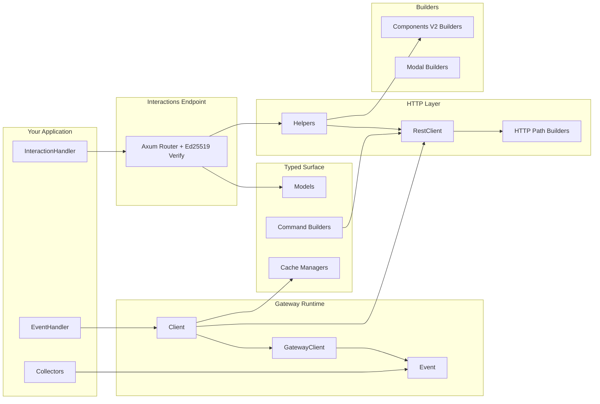

# Architecture

`discord.rs` is split into focused modules so you can compose only what you need.

## Module Layout

- `src/builders/`: fluent payload builders for Components V2 + modals
- `src/model.rs`: typed Discord models, interactions, and ID helpers
- `src/command.rs`: typed slash/user/message command builders
- `src/gateway/`: websocket runtime, heartbeat/resume, typed event dispatch
- `src/http.rs`: `RestClient` and compatibility `DiscordHttpClient`
- `src/http_body.rs`: JSON/multipart request-body serialization and response-body parsing helpers
- `src/http_paths.rs`: REST path, query-string, token-segment, and route-key helpers shared by `RestClient` and tests
- `src/http_rate_limit.rs`: REST route/bucket/global rate-limit state and stale bucket cleanup
- `src/cache.rs`: opt-in cache handle and manager types
- `src/collector.rs`: opt-in async collectors
- `src/parsers/`: raw + typed interaction parsing helpers
- `src/helpers.rs`: high-level reply helpers for interaction flows
- `src/interactions.rs`: HTTP endpoint mode with signature verification

## Runtime Patterns

- Gateway mode: maintain websocket session, handle typed `Event`, call `RestClient` or managers when needed
- Endpoint mode: receive signed interaction payloads, parse with `parse_interaction(...)`, respond with helpers
- Hybrid mode: use both for richer operational workflows
- Sharding and voice are dedicated feature-gated layers above the base `Client`.
- Keep future REST domain splits on the same boundary: endpoint methods stay in `RestClient`, route construction lives in `http_paths`, body encoding lives in `http_body`, and rate-limit bookkeeping lives in `http_rate_limit`.
