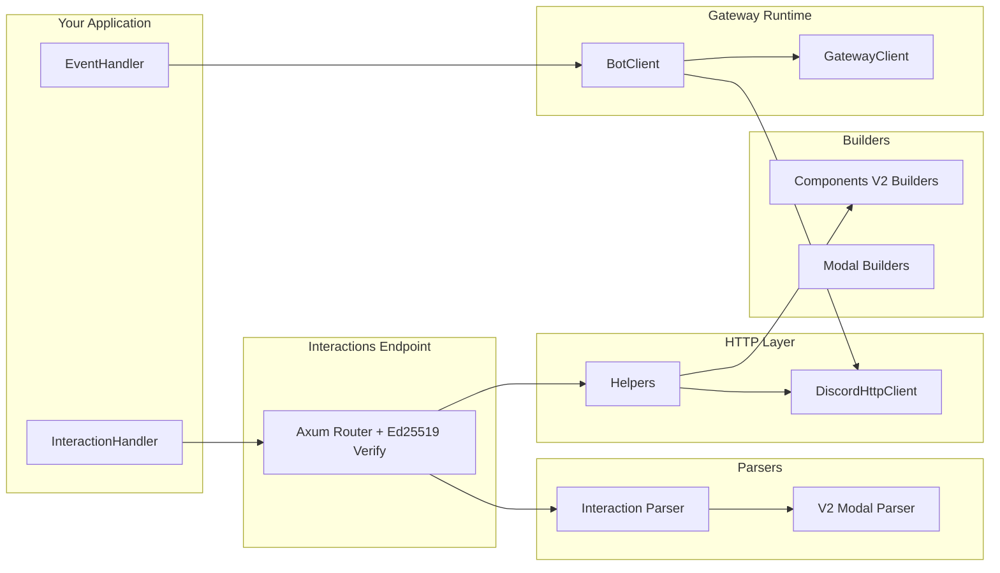

# Architecture

`discordrs` is split into focused modules so you can compose only what you need.

## Module Layout

- `src/builders/`: fluent payload builders for Components V2 + modals
- `src/gateway/`: websocket runtime, heartbeat/resume, bot event dispatch
- `src/http.rs`: REST wrapper with 429 retry support
- `src/parsers/`: typed routing/extraction from raw interaction JSON
- `src/helpers.rs`: high-level reply helpers for interaction flows
- `src/interactions.rs`: HTTP endpoint mode with signature verification

## Runtime Patterns

- Gateway mode: maintain websocket session, handle events, call HTTP when needed
- Endpoint mode: receive signed interaction payloads, parse, respond with helper APIs
- Hybrid mode: use both for richer operational workflows
