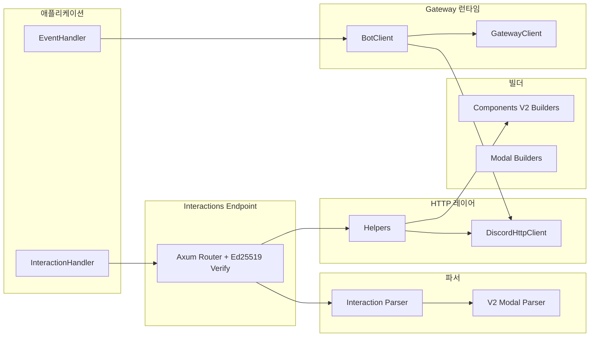

# 아키텍처

`discordrs`는 역할별 모듈 분리 구조를 가집니다.

## 모듈 구성

- `src/builders/`: Components V2, Modal 페이로드 빌더
- `src/gateway/`: WebSocket 런타임, heartbeat/resume/reconnect
- `src/http.rs`: REST 클라이언트 및 429 재시도
- `src/parsers/`: 인터랙션/모달 파싱
- `src/helpers.rs`: 응답 헬퍼
- `src/interactions.rs`: HTTP 엔드포인트 모드
